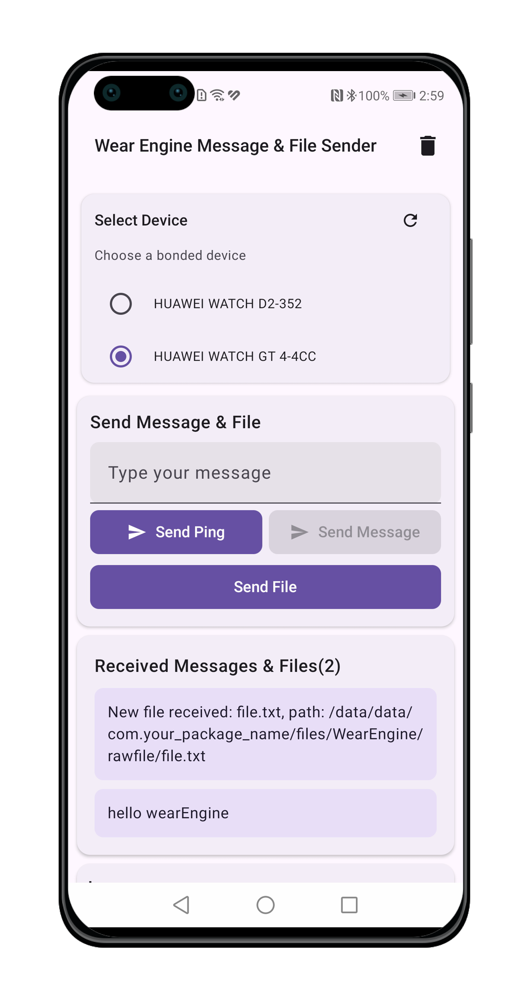
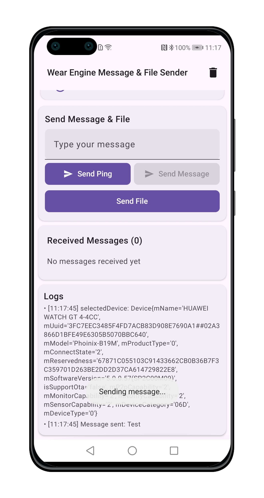
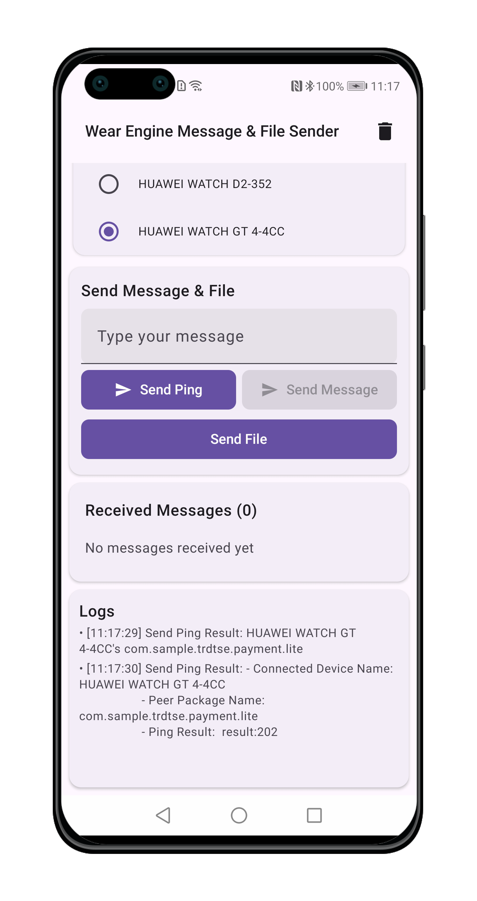
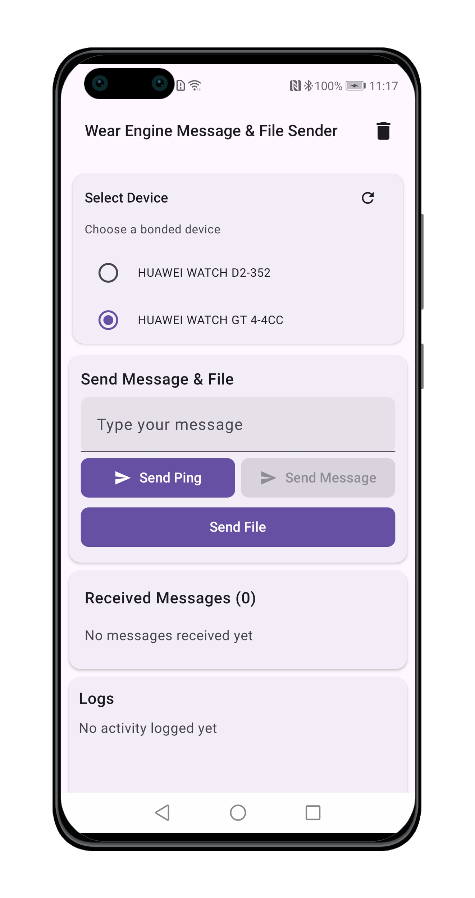

> **Note:** To access all shared projects, get information about environment setup, and view other guides, please visit [Explore-In-HMOS-Wearable Index](https://github.com/Explore-In-HMOS-Wearable/hmos-index).

# [Mobile to Watch] WearEngine Message & File Send/Receiver

Android P2P Communication Demo using Huawei Wear Engine SDK
Secure peer-to-peer communication between Android devices and Huawei wearables. 
Demonstrates message transmission, file transfer, and device management using Wear Engine SDK.

# Preview
<div>
    
    
    
    
</div>

# Use Cases
- Send secure messages between phone and watch
- Transfer files to wearable devices
- Verify if a package is installed on the target device using ping
- Automatic device discovery for paired wearables
- Permission management for wearable operations

# Technology
## Stack
- Languages: Kotlin
- Frameworks: Jetpack Compose, Wear Engine SDK, Huawei Wear Engine Services
- Tools: Android Studio,Gradle, Huawei AppGallery Connect

## Required Permissions and Configs

```android.permission.READ_EXTERNAL_STORAGE```
```com.huawei.wearengine.permission.DEVICE_MANAGER```

**P2P Communication Setup:**
- ```p2pClient.setPeerPkgName("")``` // Set peer package name
// Set peer fingerprint (For Smart Next Watch(like watch5) use appID, for [lite(like gt/fit/d/ultimate series)/smart wearable(watch4/3)](https://developer.huawei.com/consumer/en/doc/connectivity-guides/signature-0000001053969657))
- ```p2pClient.setPeerFingerPrint("")``` Set peer fingerprint

Documentation Link:
- [Applying for the Wear Engine Service](https://developer.huawei.com/consumer/en/doc/connectivity-Guides/applying-wearengine-0000001050777982)
- [Wear Engine SDK](https://developer.huawei.com/consumer/en/doc/connectivity-Guides/integrating-phone-sdk-0000001051137958)
- [Version Change History](https://developer.huawei.com/consumer/en/doc/connectivity-Guides/version-change-history-0000001086350238)
- [Android Phone App Development](https://developer.huawei.com/consumer/en/doc/connectivity-guides/phone-dev-0000001086797354)

## Key Components
P2pManager
- Handles message sending/receiving using Wear Engine P2P client
- Manages peer package fingerprint verification
- Implements ping functionality for connection testing
- Registers message receivers for bidirectional communication
- The file is saved in ```/data/data/{your app package}/files/WearEngine```.

DeviceManager
- Discovers and lists bonded Huawei wearable devices
- Retrieves device information (name, capabilities, connection status)
- Manages device selection for communication

AuthManager
- Handles `DEVICE_MANAGER` permission requests
- Validates required permissions for wearable access
- Provides permission status callbacks

# Huawei Health Kit Cloud integration (workouts)

The main screen has a **Huawei Health Kit, workouts** card. It reads the workout records
of the signed in user from **Huawei Health Kit Cloud**, which Huawei calls Cloud-side Data
Openness.

This is a different integration from Wear Engine. Wear Engine talks to the watch directly,
phone to watch. Health Kit Cloud reads the data that has already synced from the watch to
the Huawei Health app and from there to the Huawei cloud:

```
watch or band  ->  Huawei Health app  ->  Huawei cloud  ->  this app (REST API)
```

## The flow has four steps

| Step | What happens | Who does it |
| --- | --- | --- |
| 1 | Get an authorization code. The user signs in with a HUAWEI ID and allows the app. | the app, with Method 1 or Method 2 |
| 2 | Change the code into an access token and a refresh token. | your server (this demo does it in the app) |
| 3 | Call `GET /healthkit/v2/activityRecords` with the access token. | your server or the app |
| 4 | When the access token ends after 1 hour, get a new one with the refresh token. | your server |

Method 1 and Method 2 are different **only in step 1**. Steps 2, 3 and 4 are the same, so
the code for them is shared.

## The two methods

| | Method 1: web OAuth | Method 2: login-free SDK |
| --- | --- | --- |
| SDK in the app | not needed, plain HTTPS | needed, `com.huawei.hms:health` |
| Sign-in page | always | not needed when the user is already signed in on the phone |
| Where the user allows the app | Huawei page in a Custom Tab | HUAWEI ID screen, Huawei Health app, or a page Huawei hosts |
| Callback you register | your own deep link as the callback URL | Huawei's fixed callback URL, plus your deep link as the Scheme URL |
| Class in this project | `healthkit/auth/WebOAuthAuthorizer.kt` | `healthkit/auth/LoginFreeAuthorizer.kt` |

"Login-free" means the user does not type the HUAWEI ID password again when the phone is
already signed in. The user still has to allow the app. Method 2 has two solutions:
solution 1 lets the SDK pick the screen, solution 2 always uses the Huawei Health app and
also asks the user to turn on cloud sync. Both are in the app, and the card lets you
switch between them while testing.

`docs/Huawei_Health_Kit_Cloud_Integration_Guide.pdf` explains all of this in more detail.

## Setup

1. In [AppGallery Connect](https://developer.huawei.com/consumer/en/console), enable
   **Health Service Kit** for the app and apply for these scopes under **Activity
   records**. Huawei has to approve them.
   - `healthkit/activityrecord.read`
   - `healthkit/activity.read`
   - `healthkit/location.read` (only if you need the route)
2. For **Method 1**, register your deep link (for example `wearhealthkit://oauth/callback`)
   as the callback URL of the app.
3. For **Method 2**:
   - Callback URL: `https://h5hosting.dbankcdn.com/cch5/healthkit/oauth-h5/oauth-callback.html`,
     entered exactly like that. Huawei hosts this page, it is not yours.
   - Scheme URL: your own deep link. AppGallery Connect then gives you a Scheme Secret.
   - Others: apply for the login-free authorization permission for your regions.
4. Copy `local.properties.example` to `local.properties` and fill in your values:

```properties
wearengine.appId=...
healthkit.clientId=...
healthkit.clientSecret=...
healthkit.deepLink=wearhealthkit://oauth/callback
healthkit.schemeSecret=...
healthkit.authMethod=WEB_OAUTH
```

`local.properties` is in `.gitignore`, so no id or secret goes into the repository. The
build reads it into `BuildConfig`, and the deep link in `AndroidManifest.xml` is built
from the same value, so the two can never drift apart. An environment variable with the
same name (`HEALTH_KIT_CLIENT_ID` and so on) also works, which is what a CI job would use.

## Code map

```
healthkit/
  HealthKitConfig.kt          config from BuildConfig, scopes, the two enums
  HealthKitClient.kt          the entry point: steps 1 to 4 in one place
  auth/
    HealthKitAuthorizer.kt    what a method has to provide
    WebOAuthAuthorizer.kt     Method 1
    LoginFreeAuthorizer.kt    Method 2, the only file that uses the Huawei health SDK
    AuthorizationRedirect.kt  reads the code out of the deep link
  token/
    TokenStore.kt             keeps the tokens between app starts
    HealthKitTokenClient.kt   steps 2 and 4
    TokenResponse.kt
  api/
    ActivityRecordsApi.kt     step 3, with cursor paging
  net/HttpJson.kt             the small HTTP helper both of them use
  WorkoutType.kt              activityType number to name
```

`MainViewModel` only talks to `HealthKitClient`, so adding a third method later means
adding one class in `auth/`.

## Things to know before production

- The client secret is in the app here to keep this a single module. In a real app the
  app should send the authorization code to your backend, and the backend should keep the
  secret and the tokens.
- Tokens are kept in `SharedPreferences`. Use `EncryptedSharedPreferences`, or keep them
  on your backend.
- Huawei's login-free pages do not document the token request. This app sends Huawei's
  fixed callback URL as `redirect_uri` for Method 2, which is what OAuth 2.0 asks for.
  Test it with your own app, and set `SEND_REDIRECT_URI_FOR_LOGIN_FREE` to false in
  `HealthKitConfig.kt` if Huawei refuses the request.
- In test mode only 100 users can use the app. Apply for verification in AppGallery
  Connect to remove the limit. The review usually takes 7 to 15 working days.
- The health SDK comes from the Huawei Maven repository, which `settings.gradle.kts`
  already lists. Check in AppGallery Connect which SDK version your app is approved for
  and set it in `gradle/libs.versions.toml`.

## Documentation

- [Authentication (Cloud-side Data Openness)](https://developer.huawei.com/consumer/en/doc/HMSCore-Guides/auth-example-0000001054581058)
- [Login-Free Authorization, overview](https://developer.huawei.com/consumer/en/doc/HMSCore-Guides/cloud-free-auth-login-overview-0000002054076576)
- [Login-Free Authorization for Android apps](https://developer.huawei.com/consumer/en/doc/HMSCore-Guides/cloud-free-auth-login-android-0000002018842790)
- [Login-Free Authorization for iOS apps](https://developer.huawei.com/consumer/en/doc/HMSCore-Guides/cloud-free-auth-login-ios-0000001942665970)
- [Querying created exercise records](https://developer.huawei.com/consumer/en/doc/HMSCore-References/querying-created-activityrecords-0000001491423234)
